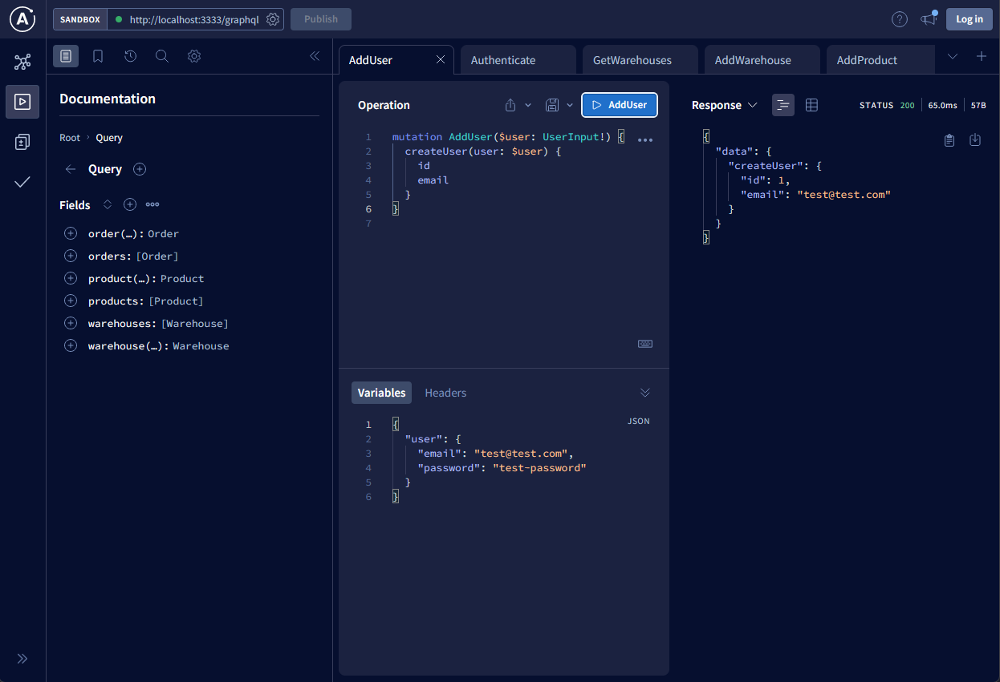
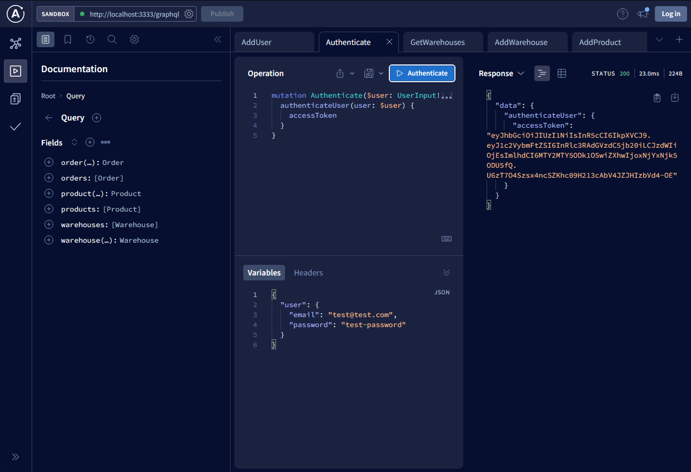
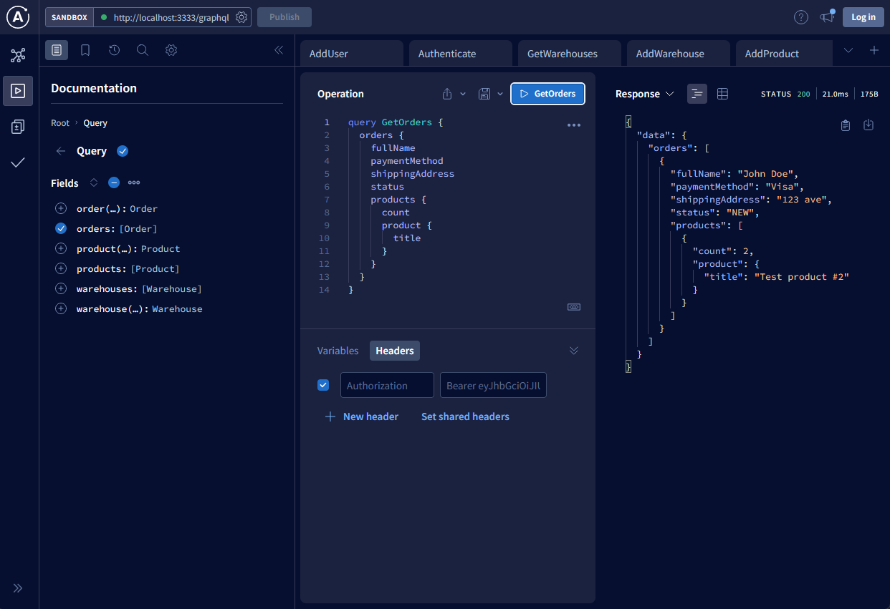
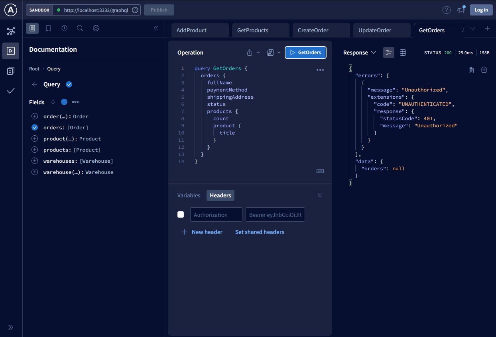

[Repo link](https://github.com/gultyaev/e-commerce-nest-graphql)

## What you will build

An online shop with a user-facing gallery of goods and a checkout page.
You can build an admin panel for adding new warehouses and filling
them with goods (or use a GraphQL explorer directly to populate the data).
When users checkout an order is created and can be then manipulated (view all orders,
update their statuses) by an authenticated user.

## What you will learn

- How to integrate GraphQL back-end server
- How to build an online shop website with admin panel
- How to authenticate with JWT

## Recommended resources to read

- [Angular Interceptors](https://angular.io/guide/http#setting-default-headers)
- [Authenticating requests with Axios](https://stackoverflow.com/a/47851585/8144405)
- [GraphQL](https://graphql.org/)
- [JWT](https://jwt.io/)

## Entities insight

### Warehouses

There is a warehouse entity. Each warehouse can contain a number of products. There should be at least one.

### Products

Products are the goods that users will be able to "buy" from you. They are stored in warehouses.

### Orders

Order contains information on how many of what products a user chose to buy, shipping details and chosen payment method.

### Users

By user for the sake of simplicity we take administrators/managers. They will be able to see the orders.
To make an order you don't need authentication.

## Examples of available API

### Creating new user

### Authentication

### Get orders

Response for an unauthenticated user is shown below.

